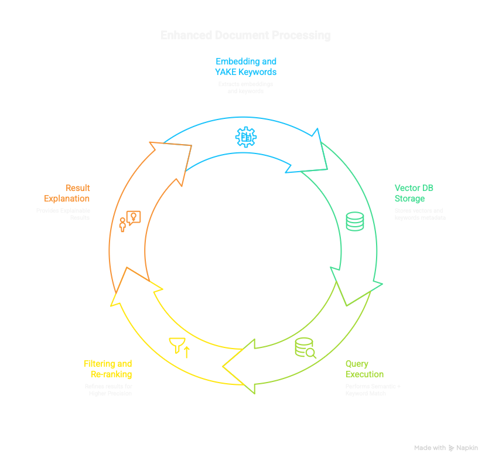

# RAG Extension: Keywords as Metadata

This demo shows how the keyword extraction system can enhance **Retrieval-Augmented Generation (RAG)**.

## Core Idea

**Problem**: Traditional RAG uses only semantic similarity (embeddings) for retrieval. This sometimes misses documents with specific terminology.

**Solution**: Store YAKE-extracted keywords as metadata in the vector database. Use hybrid search: embeddings + keyword filtering.



## Interactive Demo

```bash
# Launch Jupyter notebook
poetry run jupyter notebook rag/demo.ipynb
```

**What it does:**
1. Indexes 2 documents (ML guide, Auth guide) with YAKE keywords
2. Shows how keywords help identify relevant documents
3. Demonstrates keyword overlap in search results
4. Answers questions using RAG

The notebook is interactive - you can modify queries and see results in real-time!

## How It Works

```python
# 1. Extract keywords from document
keywords = extract_keywords(document_text, top=15)
# ['OAuth', 'authentication', 'JWT', 'Machine Learning', 'Neural Networks', ...]

# 2. Store in vector DB with metadata
collection.add(
    embeddings=[embedding],
    documents=[text],
    metadatas=[{"keywords": ", ".join(keywords)}]  # ← Key enhancement!
)

# 3. Search with keyword awareness
query_keywords = extract_keywords(query)
results = collection.query(query_embedding)

# 4. Show keyword overlap for explainability
for result in results:
    overlap = set(query_keywords) & set(result['keywords'])
    # Shows WHY this document is relevant
```

## Benefits

**Better precision**: Filter documents by terminology  
**Explainability**: See WHY a document was retrieved (keyword overlap)  
**Domain filtering**: Capture technical terms embeddings might miss  

## Structure

```
rag/
├── demo.ipynb             # Interactive Jupyter notebook
├── demo_documents/        # Sample documents
│   ├── auth_guide.txt    # Authentication doc (20 lines)
│   └── ml_guide.txt      # ML doc (14 lines)
└── README.md             # This file
```

## Real-World Use Case

**Scenario**: Internal company documentation search

1. **Index documents**: Extract keywords from wikis, design docs, meeting notes
2. **Store metadata**: Keywords become searchable filters
3. **Better retrieval**: Query "OAuth implementation" finds auth docs, not UI docs
4. **Explain results**: Show which keywords matched (transparency)

## Example Output

```
Query: Tell me about OAuth and authentication methods
Query keywords: authentication methods, OAuth, methods

Retrieved documents:
  1. auth_guide.txt
     Document keywords: Authentication Guide, OAuth Industry, JWT, Client Credentials...
     ✓ Partial overlap: oauth↔oauth industry
```

**Key insight**: The keyword overlap shows WHY auth_guide.txt was retrieved!

## Future Extensions

- **Keyword weighting**: Use YAKE scores for ranking
- **Query expansion**: Suggest related keywords from history
- **Temporal filtering**: Combine keywords + timestamps
- **Multi-vector**: Store embeddings for full text + summary + keywords

---

**Key Takeaway**: This system's keyword extraction becomes the metadata engine for RAG, improving retrieval quality with minimal code.
